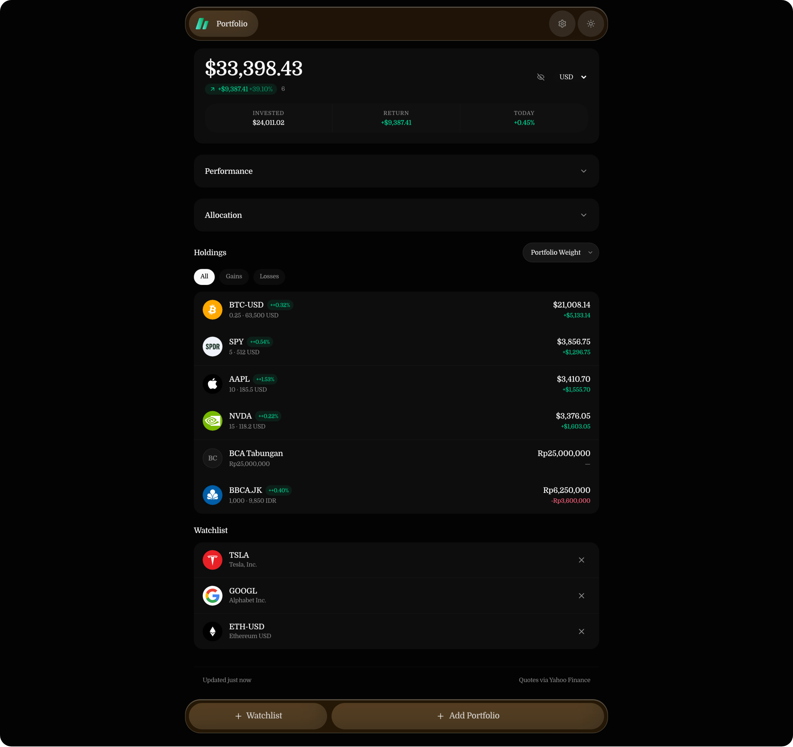
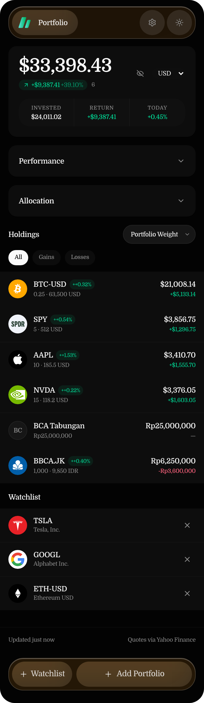

<div align="center">

# Fastvest

**A portfolio tracker that lives entirely in your browser.**
No account. No database. No tracking. Your holdings never leave your device.

[](https://nuxt.com)
[](https://vuejs.org)
[](https://www.typescriptlang.org)
[](https://tailwindcss.com)
[](https://vite-pwa-org.netlify.app)
[](LICENSE)

</div>

---

## Screenshots

### Desktop — dark



### Mobile

<p align="center">
  
</p>

---

## Why Fastvest

Most portfolio trackers want an account before they show you a number. Fastvest doesn't.

- **Nothing leaves the browser.** Holdings, cost basis, notes, preferences — all in `localStorage`.
- **Prices are fetched, not stored.** Market data flows browser → your server's Nitro route → Yahoo Finance → back. Your portfolio is never part of that request.
- **It opens and works.** No onboarding, no email, no spinner wall.
- **It keeps working offline.** Cached quotes stay on screen with an offline indicator.
- **It installs.** PWA with an app shell, so it's one tap from your home screen.

---

## Features

**Portfolio**

- Total value, cost basis, unrealized P&L, and today's P&L in one summary card
- Performance chart reconstructed from when you added each holding
- Allocation donut, tappable to filter holdings by position or currency
- Holdings table — price, market value, average cost, P&L, daily change; sortable on desktop, swipe-revealed actions on mobile
- Cash positions alongside equities, so a savings account is a first-class holding
- Multi-currency: USD, IDR, MYR — FX-normalized totals with per-currency breakdown

**Data entry**

- Debounced Yahoo Finance symbol search with recently searched symbols
- Fractional shares, zero-cost positions, optional currency and notes
- Manual entry for anything the market doesn't have a ticker for
- Watchlist for symbols you don't own yet

**Data safety**

- Export as JSON, or as an encrypted transfer code (passphrase-protected) to move to another device
- Import never silently overwrites — you confirm what's being replaced
- Reset is explicit and separate from import

**App**

- System / light / dark themes
- Manual and automatic refresh (60s default, smart about hidden and offline tabs)
- Stale-while-refresh quotes — the dashboard never blocks on the network
- English and Bahasa Indonesia
- Installable PWA with offline app shell
- Settings stay small on purpose: theme, language, refresh interval, transfer, reset, disclaimer

---

## Privacy model

- Portfolio configuration and preferences live **only in your browser** (`localStorage`).
- Market data requests go **server-side** through Fastvest's Nitro routes, which wrap `yahoo-finance2`.
- Portfolio contents are **never** persisted server-side, logged, or sent to analytics.
- Clearing browser storage deletes your portfolio unless you exported a backup.

---

## Tech stack

| Layer | Choice |
| --- | --- |
| App | Nuxt 4, Vue 3, TypeScript |
| Server | Nitro routes — `/api/quotes`, `/api/search`, `/api/chart`, `/api/exchange-rates` |
| Styling | Tailwind CSS v4, shadcn-vue, Lucide icons |
| Charts | ECharts via `vue-echarts` |
| Data | `yahoo-finance2` (server-side only) |
| PWA | `@vite-pwa/nuxt` |
| Tests | Vitest (unit), Playwright (E2E) |

---

## Architecture

```
Browser localStorage ──► Vue/UI state ──► local quote cache
                              │
                              ▼
                        Nitro API routes
                              │
                              ▼
                       yahoo-finance2 (server)
                              │
                              ▼
                         Yahoo Finance
```

Market data flows server-side only; portfolio data never leaves the browser.

Key areas:

- `app/composables/` — `usePortfolio`, `useQuotes`, `useSymbolSearch`, `useWatchlist`, `usePreferences`, `useI18n`, `useConnection`, `useExchangeRates`
- `app/lib/` — storage abstraction, encrypted backup codec
- `app/utils/` — financial calculations and formatting
- `server/api/` — quote, search, chart, and FX endpoints
- `server/services/` — Yahoo Finance wrapper with timeout, cache, and error normalization
- `shared/` — types and zod schemas shared by client and server

---

## Getting started

```bash
npm install
npm run dev
```

Runs on `http://localhost:3000`. A demo portfolio loads on first launch so you can see the app with real market data — clear it from the banner.

## Quality

```bash
npm run typecheck   # vue-tsc type checking
npm run lint        # ESLint
npm run test        # unit tests (Vitest)
npm run test:e2e    # end-to-end (Playwright)
npm run build       # production build
```

## PWA

The production build generates the service worker, manifest, and icons.

```bash
npm run build
npm run preview
```

Fastvest is installable and its app shell loads offline. Live market data does not work fully offline; cached prices remain visible.

---

## FAQ

### Is this financial advice?

No. **Fastvest is a portfolio monitoring tool, not financial advice.** Market data comes from Yahoo Finance and may be delayed, incomplete, or unavailable. Verify anything important with your broker or another authoritative source.

### Do I need an account?

No. There is no login, no signup, and no account system.

### Where is my data stored?

In your browser's `localStorage`. Export a `fastvest-portfolio.json` backup — or an encrypted transfer code — from Settings.

### Why aren't my prices updating?

Market data can be temporarily unavailable (Yahoo Finance has no official API). Fastvest keeps your last cached prices visible and lets you retry.

---

## Contributing

See [CONTRIBUTING.md](CONTRIBUTING.md).

## License

[GPL-3.0](LICENSE)
